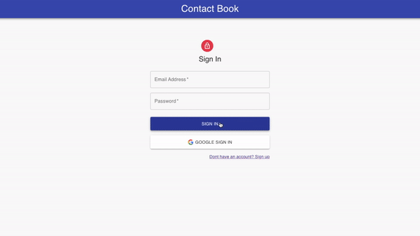

# My Contact Book Frontend App

An application that allows you to log into the system in which you can add or remove various contacts (frontend version).

<br/>



<br/>

The backend repo of this app is available [here](https://github.com/damian-lis/my-contact-book-backend-app).

The app live version is available [here](https://my-contact-book-frontend-app.vercel.app/).


<br/>

## Table of contents

1. Technologies
2. Setup

<br/>

## 1. Technologiess

The following technologies were used in the project (frontend version):

- React
- Material-UI
- Redux


<br/>

## 2. Setup

First of all, you need to make sure you have [Node.js](https://nodejs.org/en/) installed.

If you have Node.js installed clone the github repo.

Open the project in your favourite IDE and run following script for downloading dependencies:

```
npm install
# or
yarn install
```

<br/>

Then, in order to enable the user to sign in/up via google, create the google login client:

1. Enter [here](https://console.cloud.google.com/apis/credentials) and sign in/up,

1. Click on CREATE CREDENTIALS,

2. Click on OAuth client ID,

3. Select application type (web aplication),

4. Add the name of your OAuth 2.0 client,

5. Add the authorized JavaScript origins (for example: http://localhost:3000),

6. Add the authorized redirect URIs (for example: http://localhost:3000, http://localhost:3000/ and http://localhost:3000/contact),

7. Save the entered data,

8. Copy the generated Client ID key,

9. Create an .env file in your project,

10. Add the REACT_APP_GOOGLE_ID environment variable there,

11. Assign to this env variable the key you copied, and that's it.

<br/>

After that, run the development server:

```
npm start
# or
yarn start
```

Open [http://localhost:3000](http://localhost:3000) with your browser to see the result.

<br/>

To run the backend of this application, go [here](https://github.com/damian-lis/my-contact-book-backend-app).
